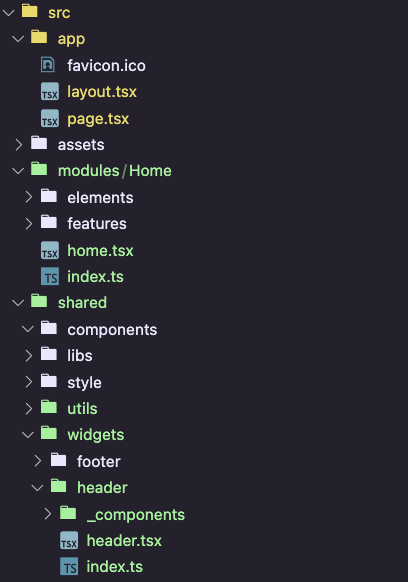

This is a [Next.js](https://nextjs.org/) project bootstrapped with [`create-next-app`](https://github.com/vercel/next.js/tree/canary/packages/create-next-app).

## Getting Started

## 首先目录结构有所不同(每个commit更新)

## 1. Full landing page design

- **types.d.ts**能够**全局**声明类型，不需要引入，直接就可以使用
- 
